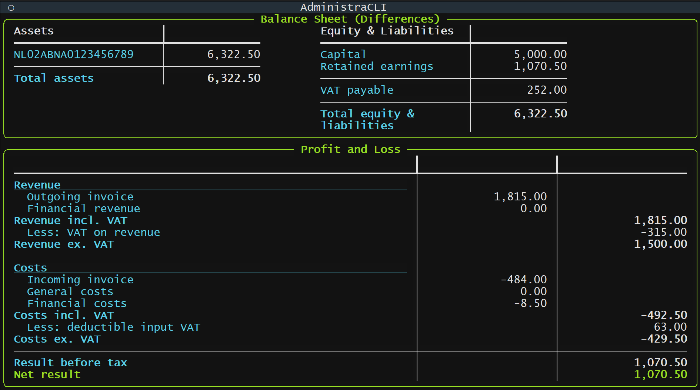
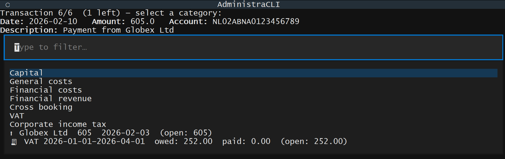

# AdministraCLI

Minimal transaction-matching and invoicing tool for small businesses.
All data lives in a single local Excel file — no server, no database.



AdministraCLI is **not** a full accounting package. It tracks bank transactions and invoices only — no fixed assets, loans, or depreciation. Create a separate workbook for each reporting year. Because you only enter mutations, the balance sheet shows **differences**, not absolute positions. Use AdministraCLI's output as input for a complete balance sheet if needed.

## Installation

```bash
pip install administracli
```

## Usage

```bash
python -m administracli init   # create administracli.xlsx
# fill in transactions and invoices in Excel
python -m administracli run    # categorise and view reports
```

`run` walks you through each uncategorised transaction. Open invoices appear alongside categories so you can match them in one step. Once everything is categorised, the balance sheet and P&L are shown.



## Corporate income tax

Categorise CIT advance payments as `Corporate income tax`. Set the definitive amount in the `settings` sheet (`cit_amount`).

- **Not yet assessed** — advances show as *CIT prepayment* on the balance sheet; nothing in the P&L.
- **Assessed** — the definitive amount appears as expense in the P&L. The difference with advances shows as *CIT receivable* or *CIT payable* on the balance sheet.

## VAT

Add periods in `vat_declarations` (start inclusive, end exclusive). Computed fields are recalculated on every run, rounded to whole euros (Dutch BTW).

- **Outgoing invoices** require `vat_rate`. Amounts are **including VAT**.
- **Incoming invoices** require exactly one of `vat_rate`, `vat_rate_abroad_from_outside_eu`, or `vat_rate_abroad_from_inside_eu`. Domestic amounts are **including VAT**; reverse-charge amounts are **excluding VAT**.

Categorise VAT payments as `VAT`. Link to a declaration for definitive payments.

## License

AGPL-3.0
